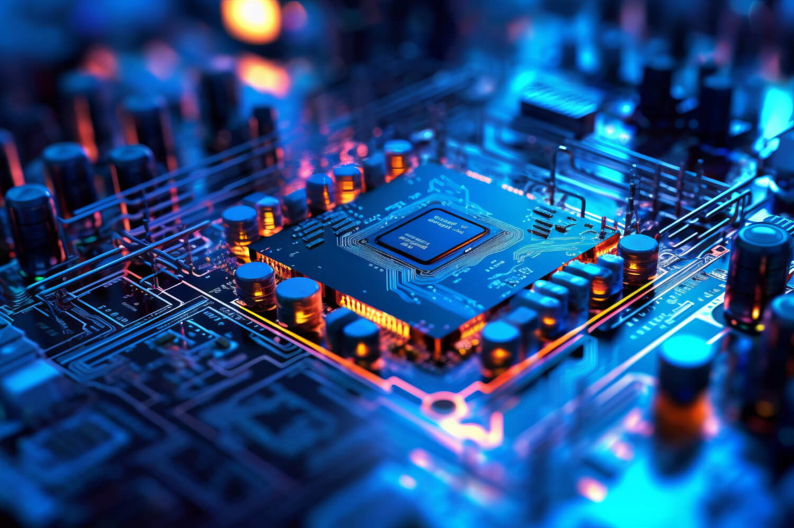

---

## 

<table align="center">
<tr>
<td width="50%" valign="top">

### 

  

**High-performance parallel prefix adder optimized for speed.**

Designed and implemented with minimized carry propagation delay. Verified through comprehensive testbenches and synthesized for FPGA implementation.

  
  
  

  

</td>
<td width="50%" valign="top">

### 

  

**Secure IoT voting system with real-time results.**

Captures votes, prevents tampering, and transmits results in real-time via MQTT to a central server for secure and transparent elections.

  
  
  
  

  

</td>
</tr>
</table>

---

## 

<table>
<tr>
<td align="center" width="25%">
 
<h3>Digital Design & VLSI</h3>
</td>
<td align="center" width="25%">
 
<h3>Embedded Systems & IoT</h3>
</td>
<td align="center" width="25%">
<h3>Hardware-Software Integration</h3>
</td>
<td align="center" width="25%">
 
<h3>Automation & Control Systems</h3>
</td>
</tr>
</table>

