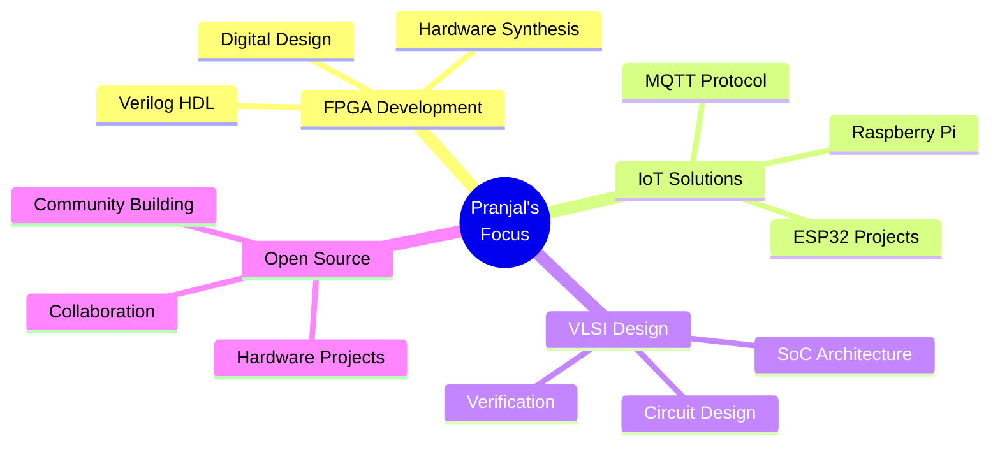

<div align="center">

<!-- Animated Typing SVG -->


<!-- Animated Wave -->


</div>

<!-- Animated Badges -->
<p align="center">
  
  
</p>

<!-- Social Stats with Animation -->
<p align="center">
  <a href="https://github.com/upadhyaypranjal">
    
  </a>
  <a href="https://github.com/upadhyaypranjal">
    
  </a>
  
</p>

---

<!-- Animated GIF Section -->
<div align="center">
  
</div>

##  About Me

```typescript
const Pranjal = {
    education: "IIITDM Kurnool",
    interests: ["VLSI Design", "Digital Systems", "IoT", "Embedded Systems"],
    currentlyExploring: ["FPGA Design", "Verilog HDL", "SoC Architectures"],
    funFact: "I turn coffee into circuits! ☕ → ⚡",
    motto: "Building tomorrow's hardware, today!"
};
```


## 🚀 Featured Projects

<div align="center">

<table>
<tr>
<td width="50%">

### 🔹 8-Bit Kogge-Stone Adder
<a href="https://github.com/upadhyaypranjal/8-Bit-Kogge-Stone-Adder">
  
</a>

**High-performance parallel prefix adder** optimized for speed by minimizing carry propagation delay.

`Verilog` • `FPGA` • `Vivado` • `Digital Design`

</td>
<td width="50%">

### 🔹 ESP32 Electronic Voting Machine
<a href="https://github.com/upadhyaypranjal/ESP32-based-Electronic-Voting-Machine">
  
</a>

**Secure IoT-based voting system** with real-time results transmission via MQTT.

`ESP32` • `C++` • `Arduino` • `IoT` • `MQTT`

</td>
</tr>
</table>

</div>


## 📊 GitHub Analytics

<div align="center">
  
  
</div>

<div align="center">
  
</div>

<div align="center">
  
</div>


## 🛠️ Tech Stack & Tools

<div align="center">

### Languages


### Hardware & IoT


### Tools & Platforms


</div>


## 🎯 Current Focus

<div align="center">



</div>


## 🤝 Connect With Me

<div align="center">

[](https://www.linkedin.com/in/pranjalupadhyay0142/)
[](https://github.com/upadhyaypranjal)
[](mailto:pranjal2004upadhyay@gmail.com)

</div>

---

<div align="center">
  
### 💫 *"The best circuits are built not from wires, but from passion and persistence."*


**Show some ❤️ by starring ⭐ some of my repositories!**

</div>
